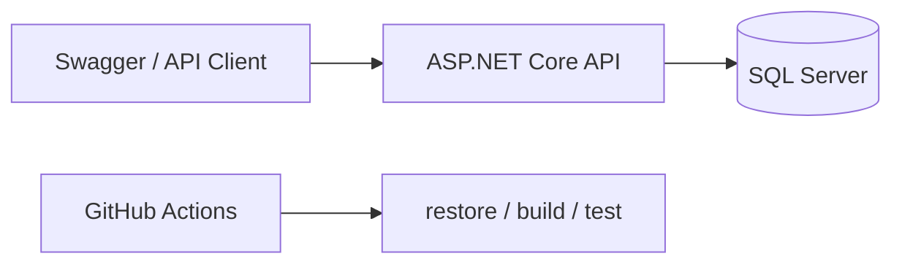
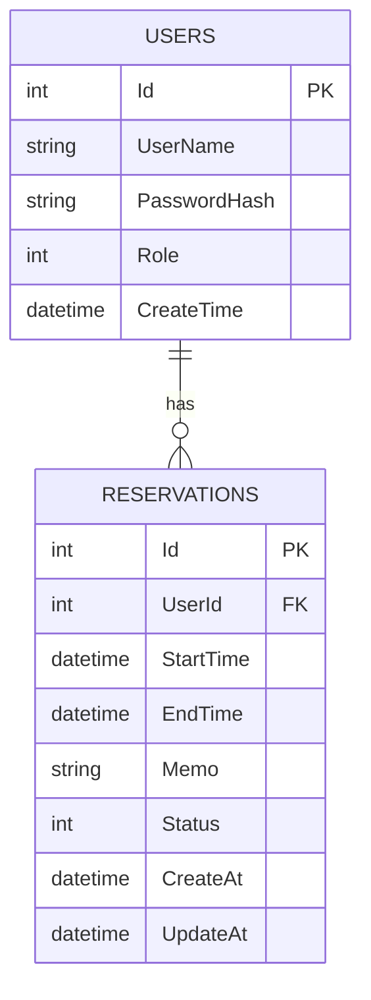
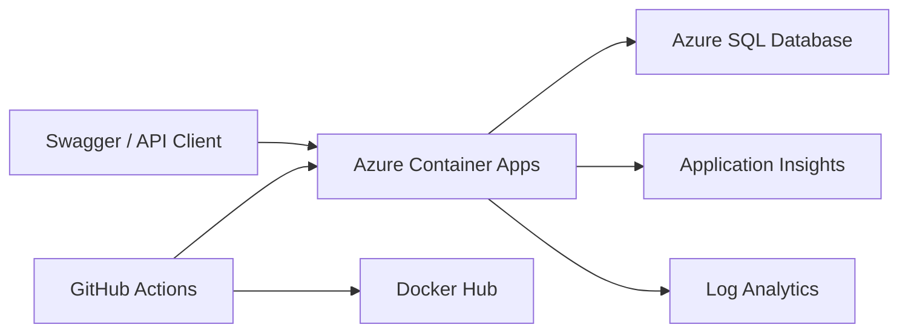

# ReservationManagerAPI2

予約管理を題材に、ASP.NET Core Web API の認証・認可、Entity Framework Core、Docker、CI、例外処理、ログ出力を学習するプロジェクトです。

## 主な機能

- ユーザー登録・ログイン
- JWT 認証
- User / Admin のロール認可
- 予約作成・一覧・詳細・キャンセル
- Admin による全予約一覧・任意予約キャンセル
- 予約時間の重複判定
- 予約状態管理: `Reserved` / `Canceled`
- 例外 Middleware による HTTP エラーの統一
- `ILogger` による予約操作ログ

## 学習・実装状況

### これまでに実装したこと

- [x] Entity Framework Core と SQL Server
- [x] JWT 認証と User / Admin 認可
- [x] Service 層への業務ロジック分離
- [x] 予約重複判定・状態管理
- [x] Dockerfile による API のコンテナ化
- [x] Docker Compose による API + SQL Server 起動
- [x] `.env` による環境変数管理
- [x] GitHub Actions による build / test
- [x] xUnit による ReservationService の単体テスト
- [x] 例外 Middleware と `400 / 401 / 403 / 404 / 409 / 500`
- [x] `ILogger` による業務ログ
- [x] Docker 上での業務ログ確認

### これから学ぶこと

- [ ] テストケースの拡充 
- [ ] README の継続的な更新

## 構成

```text
ReservationManagerAPI2/
|- src/
|  `- ReservationManagerAPI2/        # API 本体
|- tests/
|  `- ReservationManagerAPI2.Tests/  # xUnit テスト
|- .github/workflows/ci.yml          # GitHub Actions
|- .env.example                      # 環境変数のひな形
|- docker-compose.yml
|- Dockerfile
`- ReservationManagerAPI2.sln
```



Docker Compose 内では、API から SQL Server へ `localhost` ではなく `db` サービス名で接続します。

## Docker 起動

### 1. 環境変数ファイルを作成

```powershell
Copy-Item .env.example .env
```

`.env` を開き、プレースホルダーのパスワード・JWT キーを開発用の値へ変更します。

### 2. API と DB を起動

```powershell
docker compose up --build
```

Swagger:

```text
http://localhost:8080/swagger
```

停止・削除:

```powershell
docker compose down
```

DB データも削除する場合だけ、次を使用します。

```powershell
docker compose down -v
```

> `down -v` は SQL Server のユーザー・予約データを削除します。

## 環境変数

| 変数名 | 用途 |
| --- | --- |
| `MSSQL_SA_PASSWORD` | SQL Server の `sa` パスワード |
| `JWT_KEY` | JWT 署名用の秘密鍵 |
| `JWT_ISSUER` | JWT の発行者 |
| `JWT_AUDIENCE` | JWT の利用対象 |
| `JWT_EXPIRE_MINUTES` | JWT の有効期限（分） |
| `ADMIN_USER_NAME` | 初期 Admin のユーザー名 |
| `ADMIN_USER_PASSWORD` | 初期 Admin のパスワード |

`.env` は `.gitignore` で除外し、GitHub へ commit しません。

## テストと CI

ローカルでのテスト:

```powershell
dotnet test ReservationManagerAPI2.sln
```

現在のテストでは、以下を確認しています。

- 重複予約は `ConflictException` になる
- 存在しない予約詳細は `NotFoundException` になる
- 存在しない予約のキャンセルは `NotFoundException` になる
- キャンセル済み予約の再キャンセルは `ConflictException` になる

GitHub Actions は push 時に次を自動実行します。

```text
dotnet restore
dotnet build
dotnet test
```

## API 一覧

| 分類 | メソッド | URL | 認証 | 内容 |
| --- | --- | --- | --- | --- |
| Auth | POST | `/api/auth/register` | 不要 | ユーザー登録 |
| Auth | POST | `/api/auth/login` | 不要 | ログイン・JWT 発行 |
| Reservation | POST | `/api/reservations` | User / Admin | 予約作成 |
| Reservation | GET | `/api/reservations` | User / Admin | 自分の予約一覧 |
| Reservation | GET | `/api/reservations/{id}` | User / Admin | 自分の予約詳細 |
| Reservation | PATCH | `/api/reservations/{id}/cancel` | User / Admin | 自分の予約キャンセル |
| Admin | GET | `/api/admin/reservations` | Admin | 全予約一覧 |
| Admin | PATCH | `/api/admin/reservations/{id}/cancel` | Admin | 任意予約キャンセル |

Swagger の **Authorize** には、ログインで取得した JWT 本体だけを貼り付けます。`Bearer ` は付けません。

## エラー処理

業務例外は `ExceptionHandlingMiddleware` が HTTP エラーへ変換します。

| ステータス | 例 |
| --- | --- |
| `400 Bad Request` | 終了日時が開始日時より前、過去日時 |
| `401 Unauthorized` | JWT が未設定・無効 |
| `403 Forbidden` | User が Admin API へアクセス |
| `404 Not Found` | 指定した予約が存在しない |
| `409 Conflict` | 重複予約、キャンセル済み予約の再キャンセル |
| `500 Internal Server Error` | 想定外の例外 |

エラー応答は `ProblemDetails` 形式です。

```json
{
  "title": "Conflict",
  "status": 409,
  "detail": "すでに予約されています"
}
```

## ログ

`ReservationService` では次の業務イベントをログ出力します。

- 予約作成成功: `Information`
- 重複予約検出: `Warning`
- ユーザー・管理者による予約キャンセル: `Information`

`ExceptionHandlingMiddleware` では、想定外の例外を `Error` として HTTP メソッド・パスとともに記録します。

ログへ JWT、パスワード、接続文字列などの秘密情報は出力しません。

## ER 図



## Azure 公開・運用基礎

このプロジェクトは、Docker イメージを Azure Container Apps で実行し、Azure SQL Database をデータベースとして利用します。



| リソース | 用途 |
| --- | --- |
| Azure Container Apps | ReservationManagerAPI をコンテナとして実行する |
| Azure SQL Database | ユーザーと予約データを永続化する |
| Application Insights | HTTP リクエスト、例外、依存関係を確認する |
| Log Analytics | コンテナとアプリケーションのログを検索する |
| Docker Hub | デプロイする Docker イメージを管理する |
| GitHub Actions | build / test / Docker push / Azure へのデプロイを自動化する |

### Azure の環境変数とシークレット

Azure Container Apps では、接続文字列や JWT 秘密鍵をシークレットとして保存し、環境変数から ASP.NET Core に渡します。
実際の接続文字列、パスワード、JWT 秘密鍵は README、Git、Docker イメージに含めません。

| 環境変数名 | 用途 |
| --- | --- |
| `ConnectionStrings__DefaultConnection` | Azure SQL Database の接続文字列 |
| `Jwt__Key` | JWT の署名に使う秘密鍵 |
| `Jwt__Issuer` | JWT の発行者 |
| `Jwt__Audience` | JWT の利用対象 |
| `AdminUser__UserName` | 初期管理者ユーザー名 |
| `AdminUser__Password` | 初期管理者パスワード |
| `APPLICATIONINSIGHTS_CONNECTION_STRING` | Application Insights への送信先 |
| `OTEL_SERVICE_NAME` | 監視画面で識別するサービス名 |

### Azure SQL Database への Migration 適用

Azure SQL Database を作成した後、ローカルの User Secrets に Azure SQL の接続文字列を設定してから Migration を適用します。

```powershell
dotnet ef database update --project src/ReservationManagerAPI2/ReservationManagerAPI2.csproj --startup-project src/ReservationManagerAPI2/ReservationManagerAPI2.csproj
```

Migration が適用されると、Azure SQL Database に `Users`、`Reservations`、`__EFMigrationsHistory` テーブルが作成されます。

### Azure 上のログと監視

Application Insights と Log Analytics で、公開中 API の状態を確認できます。

| 確認対象 | 主な確認場所 |
| --- | --- |
| HTTP メソッド、応答コード、処理時間 | Application Insights の `AppRequests` |
| Azure SQL Database 接続 | Application Insights の `AppDependencies` |
| `ILogger` の予約作成・重複予約・キャンセルのログ | Log Analytics の `ContainerAppConsoleLogs` |
| コンテナの起動失敗や再起動 | Container Apps のリビジョンログ |

### GitHub Actions による CI/CD

`main` ブランチへの push または手動実行で、GitHub Actions が次の順番に処理します。

1. `dotnet restore`
2. `dotnet build --configuration Release`
3. `dotnet test --configuration Release`
4. Docker イメージをコミット SHA のタグで Docker Hub へ push
5. Azure Container Apps を新しいイメージへ更新

`build` または `test` が失敗した場合、`deploy` ジョブは実行されません。
Azure へのログインには GitHub Actions の OIDC を使い、Azure のパスワードやサービスプリンシパルのシークレットを GitHub に保存しません。

GitHub Secrets には次の値を設定します。値そのものは表示・コミットしません。

| GitHub Secret | 用途 |
| --- | --- |
| `AZURE_CLIENT_ID` | Azure アプリケーション登録のクライアント ID |
| `AZURE_TENANT_ID` | Microsoft Entra テナント ID |
| `AZURE_SUBSCRIPTION_ID` | Azure サブスクリプション ID |
| `DOCKERHUB_USERNAME` | Docker Hub ユーザー名 |
| `DOCKERHUB_TOKEN` | Docker Hub のアクセストークン |

### 学習環境のコスト管理

- Azure SQL Database は無料プランを使用し、超過分の請求を無効にしています。
- Container Apps は最小レプリカ数を `0` にして、アクセスがないときはスケールダウンします。
- 学習を終了するときは、リソースグループを削除すると関連リソースをまとめて停止・削除できます。
