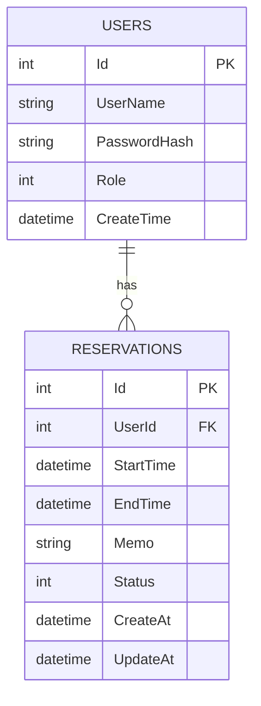

# ReservationManagerAPI2

## 主な機能

### 認証

- ユーザー登録
- パスワードのハッシュ化
- ログイン
- JWT発行
- JWTからUserId / Roleを取得

### 予約管理

- 予約作成
- 自分の予約一覧取得
- 自分の予約詳細取得
- 自分の予約キャンセル
- 過去日時の予約防止
- StartTime / EndTime のバリデーション
- 予約重複防止
- Canceled状態の予約を重複判定から除外

### Admin機能

- 全ユーザーの予約一覧取得
- 任意の予約キャンセル
- `[Authorize(Roles = "Admin")]` によるAdmin専用API
- 初期Adminユーザー作成

## Entity構成

### User

- Id
- UserName
- PasswordHash
- Role
- CreateTime

### UserRole

- User
- Admin

### Reservation

- Id
- UserId
- StartTime
- EndTime
- Memo
- Status
- CreateAt
- UpdateAt
- User

### ReservationStatus

- Reserved
- Canceled

## API一覧

### Auth

- `POST /api/auth/register`
- `POST /api/auth/login`

### Reservations

- `POST /api/reservations`
- `GET /api/reservations`
- `GET /api/reservations/{id}`
- `PATCH /api/reservations/{id}/cancel`

### Admin

- `GET /api/admin/reservations`
- `PATCH /api/admin/reservations/{id}/cancel`

## API詳細

| 区分 | メソッド | URL | 認証 | 権限 | 内容 |
| --- | --- | --- | --- | --- | --- |
| Auth | POST | `/api/auth/register` | 不要 | なし | 一般ユーザーを登録する |
| Auth | POST | `/api/auth/login` | 不要 | なし | ログインしてJWTを取得する |
| Reservations | POST | `/api/reservations` | 必要 | User / Admin | 自分の予約を作成する |
| Reservations | GET | `/api/reservations` | 必要 | User / Admin | 自分の予約一覧を取得する |
| Reservations | GET | `/api/reservations/{id}` | 必要 | User / Admin | 自分の予約詳細を取得する |
| Reservations | PATCH | `/api/reservations/{id}/cancel` | 必要 | User / Admin | 自分の予約をキャンセルする |
| Admin | GET | `/api/admin/reservations` | 必要 | Admin | 全ユーザーの予約一覧を取得する |
| Admin | PATCH | `/api/admin/reservations/{id}/cancel` | 必要 | Admin | 任意の予約をキャンセルする |

## ER図



## 予約ルール

### 日時チェック

- `EndTime` は `StartTime` より後であること
- 過去日時は予約不可

### 重複判定

既存予約と新規予約が重なる場合は予約不可にします。

```csharp
existingReservation.StartTime < newReservation.EndTime
    && existingReservation.EndTime > newReservation.StartTime
```

ただし、`Canceled` 状態の予約は重複判定の対象外です。

## 認可ルール

### User

可能:

- 自分の予約作成
- 自分の予約一覧取得
- 自分の予約詳細取得
- 自分の予約キャンセル

不可:

- 他人の予約閲覧
- 他人の予約キャンセル
- Admin APIへのアクセス

### Admin

可能:

- 全ユーザーの予約一覧取得
- 任意の予約キャンセル

## 設定

### 接続文字列

`appsettings.json` の `DefaultConnection` を使用します。

```json
{
  "ConnectionStrings": {
    "DefaultConnection": "Server=(localdb)\\MSSQLLocalDB;Database=ReservationManagerAPI2Db;Trusted_Connection=True;TrustServerCertificate=true"
  }
}
```

### JWT設定

`appsettings.json` にJWTのIssuer / Audience / 有効期限を設定します。

```json
{
  "Jwt": {
    "Issuer": "ReservationManagerAPI2",
    "Audience": "ReservationManagerAPI2Users",
    "ExpireMinutes": 60
  }
}
```

JWT秘密鍵はGitHubに上げないため、User Secretsなどで管理します。

```powershell
dotnet user-secrets set "Jwt:Key" "your-secret-key"
```

### 初期Admin

初期AdminユーザーもUser Secretsから読み込みます。

```powershell
dotnet user-secrets set "AdminUser:UserName" "admin"
dotnet user-secrets set "AdminUser:Password" "AdminPassword123!"
```

## 動作確認の流れ

1. アプリを起動する
2. 一般ユーザーを登録する
3. 一般ユーザーでログインしてJWTを取得する
4. Userトークンで予約を作成する
5. 重複予約が拒否されることを確認する
6. 自分の予約一覧・詳細を確認する
7. 自分の予約をキャンセルする
8. AdminでログインしてJWTを取得する
9. Adminトークンで全予約一覧を確認する
10. Adminトークンで任意予約をキャンセルする
11. UserトークンでAdmin APIにアクセスできないことを確認する

## 想定するHTTPステータス

- `200 OK`: 取得・ログイン・キャンセル成功
- `201 Created`: 予約作成成功
- `400 Bad Request`: 入力エラー、重複予約、キャンセル済み予約の再キャンセル
- `401 Unauthorized`: 未ログイン、JWT不正
- `403 Forbidden`: User権限でAdmin APIへアクセス
- `404 Not Found`: 対象予約が存在しない、または自分の予約ではない
